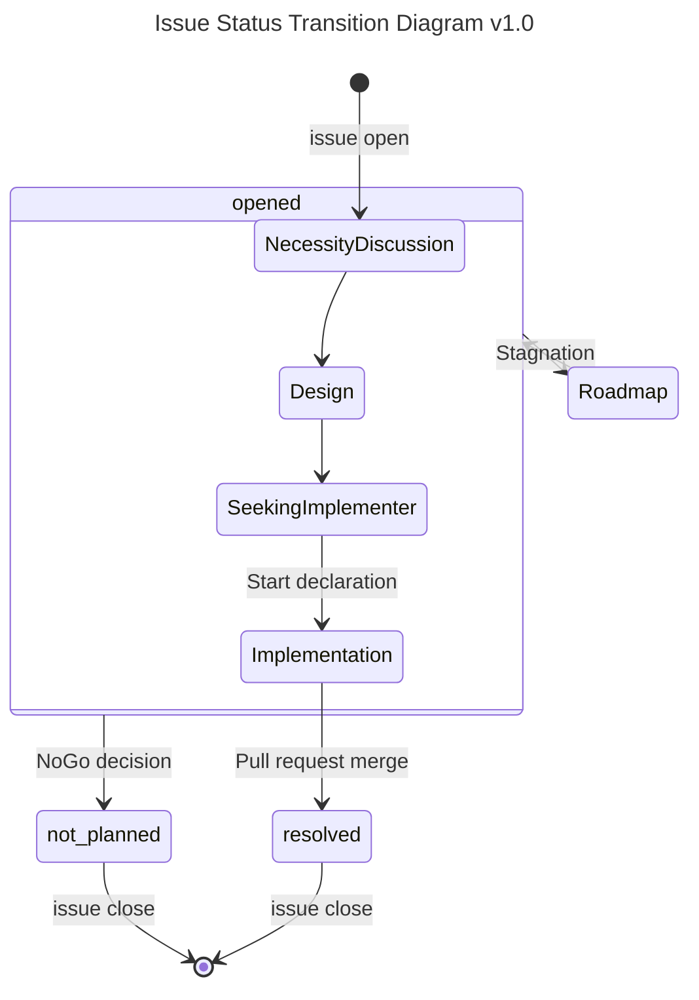

# Contributor's Guide

[Japannese](./CONTRIBUTING.md)

VOICEVOX ENGINE is an open-source project. This project is actively developed, and its results are reflected in the production version of VOICEVOX. VOICEVOX ENGINE welcomes contributions from the community.  
This guide provides information to assist contributors, including development policies, pull request procedures, and review processes.

## Table of Contents

You can check the guidelines for VOICEVOX ENGINE policies from the following:

- [Development Governance](#development-governance)
- [Versioning](#versioning)
- [Branch Strategy](#branch-strategy)
- [Pull Requests](#pull-requests)
- [Reviews](#reviews)
- [Bugs](#bugs)
- [Feature Improvements](#feature-improvements)
- [Static Analysis](#static-analysis)
- [Tests](#tests)
- [License](#license)

You can check the guidelines according to the contributor's purpose from the following:

- [Submitting a Pull Request](#submitting-a-pull-request)
- Bugs
  - [Finding Bugs](#finding-bugs)
  - [Reporting Bugs](#reporting-bugs)
  - [Fixing Bugs](#fixing-bugs)
- Feature Improvements
  - [Finding Feature Improvement Tasks](#finding-feature-improvement-tasks)
  - [Requesting Features](#requesting-features)
  - [Implementing Feature Improvements](#implementing-feature-improvements)
- [Setting Up the Environment](#setting-up-the-environment)
- [Running the Code](#running-the-code)

You can check frequently used commands for development from the following:

- [Installing Dependencies](#installing-dependencies)
- [Running Without Voice Library](#running-without-voice-library)
- Packages
  - [Adding Packages](#adding-packages)
  - [Updating Packages](#updating-packages)
  - [Reflecting Package Information to pip requirements.txt File](#reflecting-package-information-to-pip-requirementstxt-file)
- Static Analysis
  - [Checking for Typos](#checking-for-typos)
  - [Running Static Analysis in Batch](#running-static-analysis-in-batch)
- Tests
  - [Testing the Code](#testing-the-code)
  - [Updating Snapshots](#updating-snapshots)
  - [Diagnosing Vulnerabilities](#diagnosing-vulnerabilities)

## Development Governance

VOICEVOX ENGINE conducts open development based on GitHub.  
We accept feature requests, bug reports, and questions from the community through GitHub Issues. We also welcome pull requests. When creating a pull request to resolve an issue, we recommend either informing on the issue side that you've started working on it, or initially creating a Draft pull request to avoid working on the same issue as someone else.

To facilitate more casual development, we have discussions and chats on the [VOICEVOX Unofficial Discord Server](https://discord.gg/WMwWetrzuh). Feel free to join us.

## Versioning

We adopt semantic versioning.  
At this stage, the major version is 0, and we allow minor updates that include breaking changes. We update the minor version for major feature additions and changes, and the patch version for bug fixes and character additions.

You can check the summary of changes for each version in the [Releases](https://github.com/VOICEVOX/voicevox_engine/releases).

## Branch Strategy

We adopt GitHub Flow with release branches as our branch strategy.  
Pull requests are basically merged into the `master` branch. As an exception, at the time of updating the production version of VOICEVOX, a release branch `release-X.Y` is prepared, temporarily branching from `master`. Commits necessary for the release are made to `release-X.Y`, and releases are made from this branch. Hotfixes immediately after release are first merged into `release-X.Y`, and after the release, the entire branch is merged into `master`.

## Pull Requests

All code changes are made through pull requests.  
Pull requests are managed collectively on [GitHub Pull requests](https://github.com/VOICEVOX/voicevox_engine/pulls) and merged after [review](#reviews). VOICEVOX ENGINE welcomes pull requests from the community.

### Submitting a Pull Request

You can create a pull request by following these steps:

- Set up the [development environment](#setting-up-the-environment)
- Fork this repository and create a branch for your pull request from the `master` branch
- [Install the dependencies](#installing-dependencies)
- (Optional) [Install the voice library](#installing-the-voice-library)
- [Edit the code](#editing-the-code)
- [Run static analysis in batch](#running-static-analysis-in-batch) ([Type checking](#type-checking), [Linting](#linting), [Formatting](#formatting))
- [Test the code](#testing-the-code)
- Push the branch to remote and create a pull request to this repository

## Reviews

All pull requests are merged after review.  
Reviews are conducted openly on [GitHub Pull requests](https://github.com/VOICEVOX/voicevox_engine/pulls), and anyone in the community can participate in the form of comments. After review, it will be merged into the `master` (or `release-X.Y`) branch. Merging requires approval from the VOICEVOX team.

## Bugs

We use GitHub Issues to centrally manage bugs.

### Finding Bugs

You can access the list of known bugs by [filtering with the `bug` label](https://github.com/VOICEVOX/voicevox_engine/issues?q=is%3Aissue+is%3Aopen+label%3Abug). The status of bug fixes can be checked in each bug's issue.

### Reporting Bugs

If you find a bug that is not in the list of known bugs (new bug), you can report it on GitHub Issues. VOICEVOX ENGINE welcomes reports of new bugs.

### Fixing Bugs

Bug fixes are discussed on the Issue and fixed using pull requests. The procedure for creating a pull request is guided in "[Submitting a Pull Request](#submitting-a-pull-request)". VOICEVOX ENGINE welcomes pull requests that fix bugs.

## Feature Improvements

We use GitHub Issues to centrally manage feature improvements.

### Finding Feature Improvement Tasks

You can access the list of new feature additions and specification changes by [filtering with the `feature improvement` label](https://github.com/VOICEVOX/voicevox_engine/issues?q=is%3Aissue+is%3Aopen+label%3A機能向上). The implementation status of feature improvements can be checked in each feature improvement's issue.

### Requesting Features

If you have a feature improvement proposal that is not in the existing proposal list, you can propose it on GitHub Issues. VOICEVOX ENGINE welcomes feature improvement proposals.

### Implementing Feature Improvements

Feature improvements are discussed on the Issue and implemented using pull requests. The procedure for creating a pull request is guided in "[Submitting a Pull Request](#submitting-a-pull-request)". VOICEVOX ENGINE welcomes pull requests that implement feature improvements.

## Setting Up the Environment

It is developed using `Python 3.11.9`.
To install, you will need C/C++ compilers and CMake for each OS.

### Installing Dependencies

You can install the dependencies by running the following commands in the shell:

```bash
# Install execution, development, and test environments
python -m pip install -r requirements.txt -r requirements-dev.txt -r requirements-build.txt

# Install git hook
pre-commit install -t pre-push
```

## Voice Library

The OSS version of VOICEVOX ENGINE does not include the voice library of the product version of VOICEVOX, so voice synthesis is a mock version.

The voice library of the product version of VOICEVOX can be installed by following the terms of use and using one of the following procedures. This allows you to synthesize product version character voices such as "Zundamon".

### Installing the Voice Library

The voice library can be installed using one of the following procedures:

#### Installing the Voice Library Using the Product Version of VOICEVOX

You can use the voice library by installing the product version of VOICEVOX.  
Please follow the [VOICEVOX official website](https://voicevox.hiroshiba.jp/) to install the software.

#### Installing the Voice Library Using the Product Version of VOICEVOX CORE

You can use the voice library by installing the product version of VOICEVOX CORE.  
The necessary files will be prepared by the following commands:

```bash
# Define variables for CORE variation (e.g., VOICEVOX CORE v0.15.0 CPU version for x64 Linux machines)
VERSION="0.15.0"; OS="linux"; ARCHITECTURE="x64"; PROCESSOR="cpu";

# Download and extract CORE
CORENAME="voicevox_core-${OS}-${ARCHITECTURE}-${PROCESSOR}-${VERSION}"
curl -L "https://github.com/VOICEVOX/voicevox_core/releases/download/${VERSION}/${CORENAME}.zip" -o "${CORENAME}.zip"
unzip "${CORENAME}.zip"
```

The CORE variation variables can be specified with the following values:

- `VERSION`: voicevox_core version (e.g., `0.15.0`)
- `OS`: OS type (`windows` | `osx` | `linux`)
- `ARCHITECTURE`: CPU architecture (`x86` | `x64` | `arm64`)
- `PROCESSOR`: Processor type (`cpu` | `gpu` | `cuda` | `directml`)

The latest release can be found [here](https://github.com/VOICEVOX/voicevox_core/releases/latest).

## Running the Code

Running VOICEVOX ENGINE will start an HTTP server.  
Check the details of command-line arguments with the following command:

```bash
python run.py --help
```

### Running Without Voice Library

If you haven't installed the voice library or want to use lightweight mock voice synthesis, you can run the engine by executing the following command in the shell:

```bash
python run.py --enable_mock
```

### Running Using the Product Version of VOICEVOX as Voice Library

```bash
VOICEVOX_DIR="C:/path/to/VOICEVOX/vv-engine" # Path to ENGINE in the product version VOICEVOX directory
python run.py --voicevox_dir=$VOICEVOX_DIR
```

### Running Using the Product Version of VOICEVOX CORE as Voice Library

```bash
VOICELIB_DIR_1="C:/path/to/core_1"; VOICELIB_DIR_2="C:/path/to/core_2"; # Path to the product version VOICEVOX CORE directory
python run.py --voicelib_dir=$VOICELIB_DIR_1 --voicelib_dir=$VOICELIB_DIR_2
```

### Changing Log to UTF8

```bash
python run.py --output_log_utf8
# or
VV_OUTPUT_LOG_UTF8=1 python run.py
```

## Editing Code

### Packages

We manage packages using `poetry`. We also generate `requirements-*.txt` files for `pip` users.  
Dependency packages must have licenses that "do not conflict with the voice library's license even when integrated with the voice library through building".  
The acceptability of major licenses is as follows:

- MIT/Apache/BSD-3: OK
- LGPL: OK (because it's dynamically separated from the core)
- GPL: Not OK (because it requires disclosure of all related code)

#### Adding Packages

```bash
poetry add `package_name`
poetry add --group dev `package_name` # Adding development dependencies
poetry add --group build `package_name` # Adding build dependencies
```

#### Updating Packages

```bash
poetry update `package_name`
poetry update # Update all
```

#### Reflecting Package Information to pip requirements.txt File

```bash
poetry export --without-hashes -o requirements.txt # If you update this, you need to update the two below as well.
poetry export --without-hashes --with dev -o requirements-dev.txt
poetry export --without-hashes --with build -o requirements-build.txt
```

## Static Analysis

### Type Checking

We employ type checking.  
The goal is to improve safety, and we use `mypy` as the checker.

For running type checks, refer to the "[Running Static Analysis in Batch](#running-static-analysis-in-batch)" section.

### Linting

We employ automatic linting.  
The goal is to improve safety, and we use `flake8` and `isort` as linters.

For running linters, refer to the "[Running Static Analysis in Batch](#running-static-analysis-in-batch)" section.

### Formatting

We employ automatic code formatting.  
The goal is to improve readability, and we use `black` as the formatter.

For running the formatter, refer to the "[Running Static Analysis in Batch](#running-static-analysis-in-batch)" section.

Note that we currently do not employ automatic document formatting. Maintainers periodically format using `prettier`.

### Typo Checking

We employ typo checking.  
The goal is to improve readability, and we use [`typos`](https://github.com/crate-ci/typos) as the checker. If there are false positives or files that should be excluded from checking, please edit `pyproject.toml` according to the [configuration file explanation](https://github.com/crate-ci/typos#false-positives).  
For local installation of `typos`, please refer to the official documentation according to your environment. If local installation is difficult, please refer to the results of `typos` automatically executed by GitHub Actions during pull requests.

#### Checking for Typos

Execute the following command in the shell to check for typos:

```bash
typos
```

### Running Static Analysis in Batch

Execute the following command in the shell to run static analysis ([type checking](#type-checking), [linting](#linting), [formatting](#formatting)) in batch.  
Automatic corrections will be made where possible.

```bash
pysen run format lint
```

## Testing

We employ automated testing.  
To aim for long-term stable development, we have enriched both unit tests and End-to-End tests, and we also adopt snapshot tests to guarantee the invariance of values. We use `pytest` as the test runner.

### Testing Code

Execute the following command in the shell to run tests:

```bash
python -m pytest
```

### Updating Snapshots

When code changes alter expected output values, it may be necessary to update snapshots.  
Execute the following command in the shell to update snapshots:

```bash
python -m pytest --snapshot-update
```

### Diagnosing Vulnerabilities

We ensure the safety of dependency packages through vulnerability diagnosis using `safety`.  
Execute the following command in the shell to diagnose vulnerabilities:

```bash
safety check -r requirements.txt -r requirements-dev.txt -r requirements-build.txt
```

## Building

The build created by this method differs from what is publicly released. Also, for GPU usage, additional libraries such as cuDNN, CUDA, or DirectML are required.

```bash
OUTPUT_LICENSE_JSON_PATH=licenses.json \
bash tools/create_venv_and_generate_licenses.bash

# For mock build
pyinstaller --noconfirm run.spec

# For product version build
CORE_MODEL_DIR_PATH="/path/to/core_model" \
LIBCORE_PATH="/path/to/libcore" \
LIBONNXRUNTIME_PATH="/path/to/libonnxruntime" \
pyinstaller --noconfirm run.spec
```

TODO: Describe Docker version build procedure based on GitHub Actions

### Building with Github Actions

You can build by turning on Actions in your forked repository and triggering `build-engine-package.yml` with workflow_dispatch.
The artifacts will be uploaded to Releases.

### Checking the API Documentation

The [API Documentation](https://voicevox.github.io/voicevox_engine/api/) (actual file is `docs/api/index.html`) is automatically updated.  
You can manually create the API documentation with the following command:

```bash
PYTHONPATH=. python tools/make_docs.py
```

## GitHub Actions

### Variables

| name               | description           |
| :----------------- | :-------------------- |
| DOCKERHUB_USERNAME | Docker Hub username   |

### Secrets

| name            | description                                                           |
| :-------------- | :-------------------------------------------------------------------- |
| DOCKERHUB_TOKEN | [Docker Hub access token](https://hub.docker.com/settings/security)   |

## Issue

Please report bugs, feature requests, improvement suggestions, and questions in the <a href="https://github.com/VOICEVOX/voicevox_engine/issues/new">Issue</a> section.

### Issue Status

VOICEVOX ENGINE organizes issue status transitions as follows:  
Each status corresponds to a GitHub `status: XX` label (e.g., [`status: seeking implementer`](https://github.com/VOICEVOX/voicevox_engine/labels/状態：実装者募集)).



NOTE: The decision to roadmap should be made when an issue has stagnated for 30 days in `NecessityDiscussion`, or 180 days in `Design`, `SeekingImplementer`, or `Implementation`. Support should also be considered during `Implementation` stagnation.

## License

This is a dual license of LGPL v3 and another license that does not require source code disclosure.
If you want to obtain the other license, please contact Hiho.  
X account: [@hiho_karuta](https://x.com/hiho_karuta)
