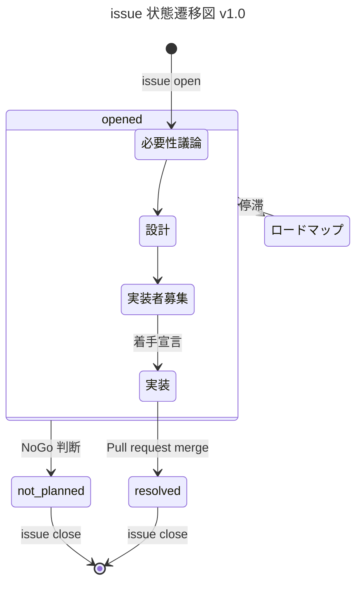

# 貢献者ガイド

VOICEVOX ENGINE はオープンソースプロジェクトです。本プロジェクトは活発に開発されており、その成果は製品版 VOICEVOX へも反映されています。VOICEVOX ENGINE はコミュニティの皆さんからのコントリビューションを歓迎しています。  
本ガイドは開発方針・プルリクエスト手順・レビュープロセスなど、コントリビュータの皆さんの一助となる情報を提供します。

## 目次

VOICEVOX ENGINE の方針に関するガイドは以下から確認できます。

- [開発ガバナンス](#開発ガバナンス)
- [バージョニング](#バージョニング)
- [ブランチ戦略](#ブランチ戦略)
- [プルリクエスト](#プルリクエスト)
- [レビュー](#レビュー)
- [バグ](#バグ)
- [機能向上](#機能向上)
- [静的解析](#静的解析)
- [テスト](#テスト)
- [ライセンス](#ライセンス)

コントリビュータの目的に応じたガイドは以下から確認できます。

- [プルリクエストを送る](#プルリクエストを送る)
- バグ
  - [バグを探す](#バグを探す)
  - [バグを報告する](#バグを報告する)
  - [バグを直す](#バグを直す)
- 機能向上
  - [機能向上タスクを探す](#機能向上タスクを探す)
  - [機能を要望する](#機能を要望する)
  - [機能を向上させる（実装する）](#機能を向上させる実装する)
- [環境構築](#環境構築)
- [コード実行](#コード実行)

開発にあたって頻繁に利用されるコマンドは以下から確認できます。

- [依存ライブラリをインストールする](#依存ライブラリをインストールする)
- [音声ライブラリ無しで実行](#音声ライブラリ無しで実行)
- パッケージ
  - [パッケージを追加する](#パッケージを追加する)
  - [パッケージを更新する](#パッケージを更新する)
  - [パッケージ情報を pip requirements.txt ファイルへ反映する](#パッケージ情報を-pip-requirementstxt-ファイルへ反映する)
- 静的解析
  - [タイポを検査する](#タイポを検査する)
  - [静的解析を一括実行する](#静的解析を一括実行する)
- テスト
  - [コードをテストする](#コードをテストする)
  - [スナップショットを更新する](#スナップショットを更新する)
  - [脆弱性を診断する](#脆弱性を診断する)

## 開発ガバナンス

VOICEVOX ENGINE は GitHub ベースのオープンな開発をおこなっています。  
コミュニティの皆さんからの機能要望・バグ報告・質問を GitHub Issues で受け付けています。またプルリクエストも歓迎しています。Issue を解決するプルリクエストを作成される際は、別の方と同じ Issue に取り組むことを避けるため、Issue 側で取り組み始めたことを伝えるか、最初に Draft プルリクエストを作成することを推奨しています。

より気軽な開発を可能にする目的で、[VOICEVOX 非公式 Discord サーバー](https://discord.gg/WMwWetrzuh)にて開発の議論や雑談を行っています。気軽にご参加ください。

## バージョニング

セマンティックバージョニングを採用しています。  
現段階ではメジャーバージョンが 0 であり、破壊的変更を含むマイナーアップデートを許容しています。大きな機能追加・変更ではマイナーバージョンを、バグ修正やキャラクター追加ではパッチバージョンを更新しています。

変更内容の概要は各バージョンの [Releases](https://github.com/VOICEVOX/voicevox_engine/releases) にて確認できます。

## ブランチ戦略

ブランチ戦略としてリリースブランチ付き GitHub Flow を採用しています。  
プルリクエストは基本的に `master` ブランチへマージされます。例外として製品版 VOICEVOX の更新時期にはリリースブランチ `release-X.Y` が用意され、一時的に `master` から分岐します。リリースに必要なコミットが `release-X.Y` へおこなわれ、このブランチからリリースがおこなわれます。リリース直後の hotfix 等は `release-X.Y` に対してまずマージされ、リリースの後にブランチごと `master` へマージされます。

## プルリクエスト

全てのコード変更はプルリクエストを介しておこなわれます。  
プルリクエストは [GitHub Pull requests](https://github.com/VOICEVOX/voicevox_engine/pulls) で一括管理され、[レビュー](#レビュー)を経てマージされます。VOICEVOX ENGINE はコミュニティの皆さんからのプルリクエストを歓迎しています。

### プルリクエストを送る

以下の手順でプルリクエストを作成できます。

- [開発環境](#環境構築)を用意する
- このレポジトリをフォークし、`master` ブランチからプルリクエスト用ブランチを作る
- [依存ライブラリをインストールする](#依存ライブラリをインストールする)
- （任意）[音声ライブラリを導入する](#音声ライブラリを導入する)
- [コードを編集する](#コードを編集する)
- [静的解析を一括実行する](#静的解析を一括実行する)（[型検査](#型検査)・[リント](#リント)・[整形](#整形)）
- [コードをテストする](#コードをテストする)
- ブランチをリモートへプッシュし、このレポジトリに対してプルリクエストを作成する

## レビュー

全てのプルリクエストはレビューを経てマージされます。  
レビューは [GitHub Pull requests](https://github.com/VOICEVOX/voicevox_engine/pulls) 上でオープンにおこなわれ、コミュニティの誰でもコメント等の形で参加可能です。レビューを経たのちに `master` (あるいは `release-X.Y`) ブランチへマージされます。マージには VOICEVOX チームによる approve が必須です。

## バグ

GitHub Issues を用いてバグを一元管理しています。

### バグを探す

[`バグ` ラベルでのフィルタリング](https://github.com/VOICEVOX/voicevox_engine/issues?q=is%3Aissue+is%3Aopen+label%3Aバグ)により既知バグの一覧にアクセスできます。バグの修正状況は各バグの issue にて確認できます。

### バグを報告する

既知バグの一覧にないバグ（新規バグ）を見つけた場合、GitHub Issues で報告が可能です。VOICEVOX ENGINE は新規バグの報告を歓迎しています。

### バグを直す

バグの修正は Issue 上で議論され、プルリクエストを用いて修正されます。プルリクエストを作成する手順は "[プルリクエストを送る](#プルリクエストを送る)" でガイドされています。VOICEVOX ENGINE はバグを修正するプルリクエストを歓迎しています。

## 機能向上

GitHub Issues を用いて機能向上を一元管理しています。

### 機能向上タスクを探す

[`機能向上` ラベルでのフィルタリング](https://github.com/VOICEVOX/voicevox_engine/issues?q=is%3Aissue+is%3Aopen+label%3A機能向上)により新規機能追加や仕様変更の一覧にアクセスできます。機能向上の実装状況は各機能向上の issue にて確認できます。

### 機能を要望する

既存提案一覧にない機能向上案がある場合、GitHub Issues で提案が可能です。VOICEVOX ENGINE は機能向上の提案を歓迎しています。

### 機能を向上させる（実装する）

機能向上は Issue 上で議論され、プルリクエストを用いて実装されます。プルリクエストを作成する手順は "[プルリクエストを送る](#プルリクエストを送る)" でガイドされています。VOICEVOX ENGINE は機能向上を実装するプルリクエストを歓迎しています。

## 環境構築

`Python 3.11.3` を用いて開発されています。
インストールするには、各 OS ごとの C/C++ コンパイラ、CMake が必要になります。

### 依存ライブラリをインストールする

シェルで以下のコマンドを実行することで依存ライブラリがインストールされます。

```bash
# 実行・開発・テスト環境のインストール
python -m pip install -r requirements.txt -r requirements-dev.txt -r requirements-build.txt

# git hook のインストール
pre-commit install -t pre-push
```

## 音声ライブラリ

OSS 版 VOICEVOX ENGINE は製品版 VOICEVOX の音声ライブラリを同梱していないため、音声合成がモック版となっています。

製品版 VOICEVOX の音声ライブラリは、利用規約を遵守の上、以下のいずれかの手順で導入できます。これにより「ずんだもん」等の製品版キャラクター音声を合成できます。

### 音声ライブラリを導入する

音声ライブラリは以下のいずれかの手順で導入できます。

#### 製品版 VOICEVOX を用いた音声ライブラリの導入

製品版 VOICEVOX を導入することで音声ライブラリを利用できます。  
[VOICEVOX 公式ホームページ](https://voicevox.hiroshiba.jp/)に従いソフトウェアを導入してください。

#### 製品版 VOICEVOX CORE を用いた音声ライブラリの導入

製品版 VOICEVOX CORE を導入することで音声ライブラリを利用できます。  
以下のコマンドにより必要なファイルが準備されます。

```bash
# CORE のバリエーション指定変数を定義する（例として x64 Linux マシン向け VOICEVOX CORE v0.15.0 CPU版）
VERSION="0.15.0"; OS="linux"; ARCHITECTURE="x64"; PROCESSOR="cpu";

# CORE をダウンロード・展開する
CORENAME="voicevox_core-${OS}-${ARCHITECTURE}-${PROCESSOR}-${VERSION}"
curl -L "https://github.com/VOICEVOX/voicevox_core/releases/download/${VERSION}/${CORENAME}.zip" -o "${CORENAME}.zip"
unzip "${CORENAME}.zip"
```

CORE のバリエーション変数は以下の値を指定できます。

- `VERSION`: voicevox_core のバージョン (例として `0.15.0`)
- `OS`: OS 種別 (`windows` | `osx` | `linux`)
- `ARCHITECTURE`: CPU アーキテクチャ (`x86` | `x64` | `arm64`)
- `PROCESSOR`: プロセッサ種別 (`cpu` | `gpu` | `cuda` | `directml`)

最新のリリースは[こちら](https://github.com/VOICEVOX/voicevox_core/releases/latest)にあります。

## コード実行

VOICEVOX ENGINE を実行することで HTTP サーバーが立ち上がります。  
コマンドライン引数の詳細は以下のコマンドで確認してください。

```bash
python run.py --help
```

### 音声ライブラリ無しで実行

音声ライブラリを導入しなかった場合あるいは軽量のモック版音声合成を利用したい場合、シェルで以下のコマンドを実行することでエンジンが実行されます。

```bash
python run.py --enable_mock
```

### 音声ライブラリに製品版 VOICEVOX を利用して実行

```bash
VOICEVOX_DIR="C:/path/to/VOICEVOX/vv-engine" # 製品版 VOICEVOX ディレクトリ内の ENGINE のパス
python run.py --voicevox_dir=$VOICEVOX_DIR
```

### 音声ライブラリに製品版 VOICEVOX CORE を利用して実行

```bash
VOICELIB_DIR_1="C:/path/to/core_1"; VOICELIB_DIR_2="C:/path/to/core_2"; # 製品版 VOICEVOX CORE ディレクトリのパス
python run.py --voicelib_dir=$VOICELIB_DIR_1 --voicelib_dir=$VOICELIB_DIR_2
```

### ログを UTF8 に変更

```bash
python run.py --output_log_utf8
# もしくは
VV_OUTPUT_LOG_UTF8=1 python run.py
```

## コードを編集する

### パッケージ

`poetry` によってパッケージを管理しています。また `pip` ユーザー向けに `requirements-*.txt` を生成しています。  
依存パッケージは「ビルドにより音声ライブラリと一体化しても、音声ライブラリのライセンスと衝突しない」ライセンスを持つ必要があります。  
主要ライセンスの可否は以下の通りです。

- MIT/Apache/BSD-3: OK
- LGPL: OK （コアと動的分離されているため）
- GPL: NG （全関連コードの公開が必要なため）

#### パッケージを追加する

```bash
poetry add `パッケージ名`
poetry add --group dev `パッケージ名` # 開発依存の追加
poetry add --group build `パッケージ名` # ビルド依存の追加
```

#### パッケージを更新する

```bash
poetry update `パッケージ名`
poetry update # 全部更新
```

#### パッケージ情報を pip requirements.txt ファイルへ反映する

```bash
poetry export --without-hashes -o requirements.txt # こちらを更新する場合は下３つも更新する必要があります。
poetry export --without-hashes --with dev -o requirements-dev.txt
poetry export --without-hashes --with build -o requirements-build.txt
```

## 静的解析

### 型検査

型検査を採用しています。  
目的は安全性の向上であり、チェッカーには `mypy` を採用しています。

型検査の実行は "[静的解析を一括実行する](#静的解析を一括実行する)" 節を参照してください。

### リント

自動リントを採用しています。  
目的は安全性の向上であり、リンターには `flake8` と `isort` を採用しています。

リンターの実行は "[静的解析を一括実行する](#静的解析を一括実行する)" 節を参照してください。

### 整形

コード自動整形を採用しています。  
目的は可読性の向上であり、フォーマッタには `black` を採用しています。

フォーマッタの実行は "[静的解析を一括実行する](#静的解析を一括実行する)" 節を参照してください。

なお、ドキュメント自動整形は現段階では採用していません。メンテナが定期的に `prettier` で整形しています。

### タイポ検査

タイポ検査を採用しています。  
目的は可読性の向上であり、チェッカーには [`typos`](https://github.com/crate-ci/typos) を採用しています。誤判定やチェックから除外すべきファイルがあれば[設定ファイルの説明](https://github.com/crate-ci/typos#false-positives)に従って `pyproject.toml` を編集してください。  
ローカルへの `typos` 導入は各自の環境に合わせて公式ドキュメントを参照してください。ローカルへの導入が難しい場合、プルリクエスト時に GitHub Actions で自動実行される `typos` の結果を参照してください。

#### タイポを検査する

シェルで以下のコマンドを実行することでタイポが検査されます。

```bash
typos
```

### 静的解析を一括実行する

シェルで以下のコマンドを実行することで静的解析（[型検査](#型検査)・[リント](#リント)・[整形](#整形)）が一括実行されます。  
この際、可能な範囲で自動修正がおこなわれます。

```bash
pysen run format lint
```

## テスト

自動テストを採用しています。  
長期的に安定した開発を目指して単体テスト・End-to-End テスト共に充実させており、値の不変を保証するスナップショットテストも採用しています。テストランナーには `pytest` を採用しています。

### コードをテストする

シェルで以下のコマンドを実行することでテストが走ります。

```bash
python -m pytest
```

### スナップショットを更新する

コード変更により想定される出力値が変わり、スナップショットの更新が必要となる場合があります。  
シェルで以下のコマンドを実行することでスナップショットが更新されます。

```bash
python -m pytest --snapshot-update
```

### 脆弱性を診断する

`safety` を用いた脆弱性診断により依存パッケージの安全性を確保しています。  
シェルで以下のコマンドを実行することで脆弱性が診断されます。

```bash
safety check -r requirements.txt -r requirements-dev.txt -r requirements-build.txt
```

## ビルド

この方法でビルドしたものは、リリースで公開されているものとは異なります。 また、GPU で利用するには cuDNN や CUDA、DirectML などのライブラリが追加で必要となります。

```bash
OUTPUT_LICENSE_JSON_PATH=licenses.json \
bash tools/create_venv_and_generate_licenses.bash

# モックでビルドする場合
pyinstaller --noconfirm run.spec

# 製品版でビルドする場合
CORE_MODEL_DIR_PATH="/path/to/core_model" \
LIBCORE_PATH="/path/to/libcore" \
LIBONNXRUNTIME_PATH="/path/to/libonnxruntime" \
pyinstaller --noconfirm run.spec
```

TODO: Docker 版のビルド手順を GitHub Actions をベースに記述する

### Github Actions でビルド

fork したリポジトリで Actions を ON にし、workflow_dispatch で`build-engine-package.yml`を起動すればビルドできます。
成果物は Release にアップロードされます。

### API ドキュメントの確認

[API ドキュメント](https://voicevox.github.io/voicevox_engine/api/)（実体は`docs/api/index.html`）は自動で更新されます。  
次のコマンドで API ドキュメントを手動で作成することができます。

```bash
PYTHONPATH=. python tools/make_docs.py
```

## GitHub Actions

### Variables

| name               | description         |
| :----------------- | :------------------ |
| DOCKERHUB_USERNAME | Docker Hub ユーザ名 |

### Secrets

| name            | description                                                             |
| :-------------- | :---------------------------------------------------------------------- |
| DOCKERHUB_TOKEN | [Docker Hub アクセストークン](https://hub.docker.com/settings/security) |

## Issue

不具合の報告、機能要望、改善提案、質問は<a href="https://github.com/VOICEVOX/voicevox_engine/issues/new">Issue</a>の方に報告してください。

### Issue の状態

VOICEVOX ENGINE では issue の状態遷移を以下のように整理しています。  
各状態は GitHub の `状態：〇〇` ラベルと対応しています（例： [`状態：実装者募集`](https://github.com/VOICEVOX/voicevox_engine/labels/状態：実装者募集)）。



NOTE: ロードマップ化すべきかの棚卸し判定は、issue が `必要性議論` で 30 日、`設計`・`実装者募集`・`実装` で 180 日停滞した場合におこなう。`実装` の停滞時にはサポートも検討する。

## ライセンス

LGPL v3 と、ソースコードの公開が不要な別ライセンスのデュアルライセンスです。
別ライセンスを取得したい場合は、ヒホに求めてください。  
X アカウント: [@hiho_karuta](https://x.com/hiho_karuta)
