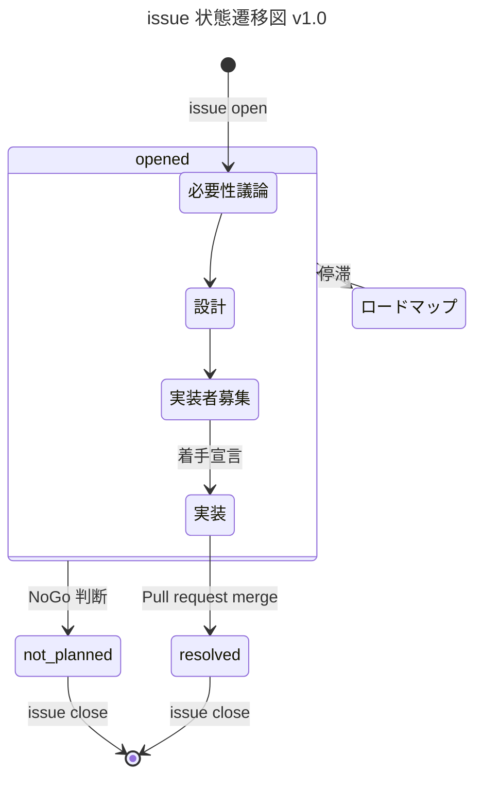

**このガイドラインは現在工事中です。**

TODO: 重複部分を省く

## 目次

- [環境構築](#環境構築)
- [スクリプトの使い方](#スクリプトの使い方)
  - [実行](#実行)
  - [テスト](#テスト)
  - [ビルド](#ビルド)
  - [コードフォーマット](#コードフォーマット)
  - [タイポチェック](#タイポチェック)
  - [API ドキュメントの確認](#APIドキュメントの確認)
  - [依存関係](#依存関係)
  - [ユーザー辞書の更新について](#ユーザー辞書の更新について)
- [Issue](#issue)

## 貢献者の方へ

Issue を解決するプルリクエストを作成される際は、別の方と同じ Issue に取り組むことを避けるため、
Issue 側で取り組み始めたことを伝えるか、最初に Draft プルリクエストを作成してください。

[VOICEVOX 非公式 Discord サーバー](https://discord.gg/WMwWetrzuh)にて、開発の議論や雑談を行っています。気軽にご参加ください。

## 環境構築

`Python 3.11.3` を用いて開発されています。
インストールするには、各 OS ごとの C/C++ コンパイラ、CMake が必要になります。

まずリポジトリをフォークします。  
次に以下の手順でローカル環境を構築します。

```bash
# レポジトリのクローン
git clone "https://github.com/<your_user_name>/voicevox_engine.git"
cd ./voicevox_engine

# プルリクエスト用ブランチの作成
git switch -c "<your_branch_name>"

# 実行・開発・テスト環境のインストール
python -m pip install -r requirements.txt -r requirements-test.txt -r requirements-build.txt
```

<!-- このプロジェクトでは
* `Python 3.11.3`
* 依存ライブラリ
  * cmake
  * libsndfile1
* (実際に動かす時のみ)製品版 VOICEVOX
を使います。 -->

次に音声ライブラリを準備します。  
OSS 版 VOICEVOX ENGINE は製品版 VOICEVOX の音声ライブラリを含んでいません。  
これら音声ライブラリは、利用規約を遵守の上、以下のいずれかの手順で導入できます。これにより「ずんだもん」等の製品版キャラクター音声を合成できます。  
なお、OSS 版 VOICEVOX ENGINE 単体でもモック利用により機能制限版の音声合成が可能です。その場合、音声ライブラリの導入は不要です。

### 製品版 VOICEVOX を用いた音声ライブラリの導入

製品版 VOICEVOX を導入することで音声ライブラリを利用できます。  
[VOICEVOX 公式ホームページ](https://voicevox.hiroshiba.jp/)に従いソフトウェアを導入してください。

### 製品版 VOICEVOX CORE を用いた音声ライブラリの導入

製品版 VOICEVOX CORE を導入することで音声ライブラリを利用できます。  
以下のコマンドにより必要なファイルが準備されます。

```bash
# CORE のバリエーション指定変数を定義する（例として x64 Linux マシン向け VOICEVOX CORE v0.15.0 CPU版）
VERSION="0.15.0"; OS="linux"; ARCHITECTURE="x64"; PROCESSOR="cpu";

# CORE をダウンロード・展開する
CORENAME="voicevox_core-${OS}-${ARCHITECTURE}-${PROCESSOR}-${VERSION}"
curl -L "https://github.com/VOICEVOX/voicevox_core/releases/download/${VERSION}/${CORENAME}.zip" -o "${CORENAME}.zip"
unzip "${CORENAME}.zip"
```

CORE のバリエーション変数は以下の値を指定できます。

- `VERSION`: voicevox_core のバージョン (例として `0.15.0`)
- `OS`: OS 種別 (`windows` | `osx` | `linux`)
- `ARCHITECTURE`: CPU アーキテクチャ (`x86` | `x64` | `arm64`)
- `PROCESSOR`: プロセッサ種別 (`cpu` | `gpu` | `cuda` | `directml`)

最新のリリースは以下にあります。
https://github.com/VOICEVOX/voicevox_core/releases/latest

## スクリプトの使い方

### 実行

VOICEVOX ENGINE を実行することで HTTP サーバーが立ち上がります。  
コマンドライン引数の詳細は以下のコマンドで確認してください。

```bash
python run.py --help
```

#### 音声ライブラリに製品版 VOICEVOX を利用して実行

```bash
VOICEVOX_DIR="C:/path/to/voicevox" # 製品版 VOICEVOX ディレクトリのパス
python run.py --voicevox_dir=$VOICEVOX_DIR
```

#### 音声ライブラリに製品版 VOICEVOX CORE を利用して実行

```bash
VOICELIB_DIR_1="C:/path/to/core_1"; VOICELIB_DIR_2="C:/path/to/core_2"; # 製品版 VOICEVOX CORE ディレクトリのパス
python run.py --voicelib_dir=$VOICELIB_DIR_1 --voicelib_dir=$VOICELIB_DIR_2
```

#### 音声ライブラリ無しで実行

```bash
python run.py --enable_mock
```

#### ログを UTF8 に変更

```bash
python run.py --output_log_utf8
# もしくは
VV_OUTPUT_LOG_UTF8=1 python run.py
```

### テスト

```bash
python -m pytest
```

#### スナップショットの更新

```bash
python -m pytest --snapshot-update
```

### ビルド

この方法でビルドしたものは、リリースで公開されているものとは異なります。 また、GPU で利用するには cuDNN や CUDA、DirectML などのライブラリが追加で必要となります。

```bash
OUTPUT_LICENSE_JSON_PATH=licenses.json \
bash build_util/create_venv_and_generate_licenses.bash

# モックでビルドする場合
pyinstaller --noconfirm run.spec

# 製品版でビルドする場合
CORE_MODEL_DIR_PATH="/path/to/core_model" \
LIBCORE_PATH="/path/to/libcore" \
LIBONNXRUNTIME_PATH="/path/to/libonnxruntime" \
pyinstaller --noconfirm run.spec
```

#### Github Actions でビルド

fork したリポジトリで Actions を ON にし、workflow_dispatch で`build-engine-package.yml`を起動すればビルドできます。
成果物は Release にアップロードされます。

### コードフォーマット

このソフトウェアでは、リモートにプッシュする前にコードフォーマットを確認する仕組み(静的解析ツール)を利用できます。 利用するには、開発に必要なライブラリのインストールに加えて、以下のコマンドを実行してください。 プルリクエストを作成する際は、利用することを推奨します。

```bash
pre-commit install -t pre-push
```

エラーが出た際は、以下のコマンドで修正することが可能です。なお、完全に修正できるわけではないので注意してください。

```bash
pysen run format lint
```

### タイポチェック

[typos](https://github.com/crate-ci/typos) を使ってタイポのチェックを行っています。 [typos をインストール](https://github.com/crate-ci/typos#install) した後

```bash
typos
```

でタイポチェックを行えます。 もし誤判定やチェックから除外すべきファイルがあれば [設定ファイルの説明](https://github.com/crate-ci/typos#false-positives) に従って`_typos.toml`を編集してください。

### API ドキュメントの確認

API ドキュメント（実体は docs/api/index.html）は自動で更新されます。
次のコマンドで API ドキュメントを手動で作成することができます。

```bash
PYTHONPATH=. python build_util/make_docs.py
```

### 依存関係

[Poetry](https://python-poetry.org/) を用いて依存ライブラリのバージョンを固定しています。 以下のコマンドで操作できます。

パッケージを追加する場合

```bash
poetry add `パッケージ名`
poetry add --group dev `パッケージ名` # 開発依存の追加
poetry add --group test `パッケージ名` # テスト依存の追加
poetry add --group build `パッケージ名` # ビルド依存の追加
```

パッケージをアップデートする場合

```bash
poetry update `パッケージ名`
poetry update # 全部更新
```

requirements.txt の更新

```bash
poetry export --without-hashes -o requirements.txt # こちらを更新する場合は下３つも更新する必要があります。
poetry export --without-hashes --with test -o requirements-test.txt
poetry export --without-hashes --with build -o requirements-build.txt
```

#### ライセンス

依存ライブラリは「コアビルド時にリンクして一体化しても、コア部のコード非公開 OK」なライセンスを持つ必要があります。  
主要ライセンスの可否は以下の通りです。

- MIT/Apache/BSD-3: OK
- LGPL: OK （コアと動的分離されているため）
- GPL: NG （全関連コードの公開が必要なため）

#### 脆弱性診断
`safety` を用いた脆弱性診断により依存パッケージの安全性を確保しています。  
以下のコマンドにより脆弱性を診断できます：  

```bash
safety check -r requirements.txt -r requirements-test.txt -r requirements-build.txt
```

### API ドキュメントの確認

[API ドキュメント](https://voicevox.github.io/voicevox_engine/api/)（実体は`docs/api/index.html`）は自動で更新されます。  
次のコマンドで API ドキュメントを手動で作成することができます。

```bash
PYTHONPATH=. python build_util/make_docs.py
```

### GitHub Actions

#### Variables

| name               | description         |
| :----------------- | :------------------ |
| DOCKERHUB_USERNAME | Docker Hub ユーザ名 |

#### Secrets

| name            | description                                                             |
| :-------------- | :---------------------------------------------------------------------- |
| DOCKERHUB_TOKEN | [Docker Hub アクセストークン](https://hub.docker.com/settings/security) |

## Issue

不具合の報告、機能要望、改善提案、質問は<a href="https://github.com/VOICEVOX/voicevox_engine/issues/new">Issue</a>の方に報告してください。

### Issue の状態
VOICEVOX ENGINE では issue の状態遷移を以下のように整理しています。  
各状態は GitHub の `状態：〇〇` ラベルと対応しています（例： [`状態：実装者募集`](https://github.com/VOICEVOX/voicevox_engine/labels/%E7%8A%B6%E6%85%8B%EF%BC%9A%E5%AE%9F%E8%A3%85%E8%80%85%E5%8B%9F%E9%9B%86)）。  


NOTE: ロードマップ化すべきかの棚卸し判定は、issue が `必要性議論` で 30 日、`設計`・`実装者募集`・`実装` で 180 日停滞した場合におこなう。`実装` の停滞時にはサポートも検討する。

## ライセンス

LGPL v3 と、ソースコードの公開が不要な別ライセンスのデュアルライセンスです。
別ライセンスを取得したい場合は、ヒホに求めてください。  
X アカウント: [@hiho_karuta](https://x.com/hiho_karuta)
