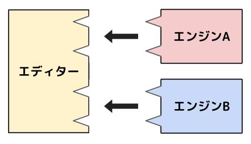

# VOICEVOX ENGINE

[](https://github.com/VOICEVOX/voicevox_engine/actions/workflows/build-engine-package.yml)
[](https://github.com/VOICEVOX/voicevox_engine/releases)
[](https://discord.gg/WMwWetrzuh)

[](https://github.com/VOICEVOX/voicevox_engine/actions/workflows/test.yml)
[](https://coveralls.io/github/VOICEVOX/voicevox_engine)

[](https://github.com/VOICEVOX/voicevox_engine/actions/workflows/build-engine-container.yml)
[](https://hub.docker.com/r/voicevox/voicevox_engine)

[VOICEVOX](https://voicevox.hiroshiba.jp/) のエンジンです。  
実態は HTTP サーバーなので、リクエストを送信すればテキスト音声合成できます。

（エディターは [VOICEVOX](https://github.com/VOICEVOX/voicevox/) 、
コアは [VOICEVOX CORE](https://github.com/VOICEVOX/voicevox_core/) 、
全体構成は [こちら](https://github.com/VOICEVOX/voicevox/blob/main/docs/%E5%85%A8%E4%BD%93%E6%A7%8B%E6%88%90.md) に詳細があります。）

## 目次

目的に合わせたガイドはこちらです。

- [ユーザーガイド](#ユーザーガイド): 音声合成をしたい方向け
- [貢献者ガイド](#貢献者ガイド): コントリビュートしたい方向け
- [開発者ガイド](#開発者ガイド): コードを利用したい方向け

## ユーザーガイド

### ダウンロード

[こちら](https://github.com/VOICEVOX/voicevox_engine/releases/latest)から対応するエンジンをダウンロードしてください。

### API ドキュメント

[API ドキュメント](https://voicevox.github.io/voicevox_engine/api/)をご参照ください。

VOICEVOX エンジンもしくはエディタを起動した状態で http://127.0.0.1:50021/docs にアクセスすると、起動中のエンジンのドキュメントも確認できます。  
今後の方針などについては [VOICEVOX 音声合成エンジンとの連携](./docs/VOICEVOX音声合成エンジンとの連携.md) も参考になるかもしれません。

### Docker イメージ

#### CPU

```bash
docker pull voicevox/voicevox_engine:cpu-ubuntu20.04-latest
docker run --rm -p '127.0.0.1:50021:50021' voicevox/voicevox_engine:cpu-ubuntu20.04-latest
```

#### GPU

```bash
docker pull voicevox/voicevox_engine:nvidia-ubuntu20.04-latest
docker run --rm --gpus all -p '127.0.0.1:50021:50021' voicevox/voicevox_engine:nvidia-ubuntu20.04-latest
```

##### トラブルシューティング

GPU 版を利用する場合、環境によってエラーが発生することがあります。その場合、`--runtime=nvidia`を`docker run`につけて実行すると解決できることがあります。

### HTTP リクエストで音声合成するサンプルコード

```bash
echo -n "こんにちは、音声合成の世界へようこそ" >text.txt

curl -s \
    -X POST \
    "127.0.0.1:50021/audio_query?speaker=1"\
    --get --data-urlencode text@text.txt \
    > query.json

curl -s \
    -H "Content-Type: application/json" \
    -X POST \
    -d @query.json \
    "127.0.0.1:50021/synthesis?speaker=1" \
    > audio.wav
```

生成される音声はサンプリングレートが 24000Hz と少し特殊なため、音声プレーヤーによっては再生できない場合があります。

`speaker` に指定する値は `/speakers` エンドポイントで得られる `style_id` です。互換性のために `speaker` という名前になっています。

### 音声を調整するサンプルコード

`/audio_query` で得られる音声合成用のクエリのパラメータを編集することで、音声を調整できます。

例えば、話速を 1.5 倍速にしてみます。

```bash
echo -n "こんにちは、音声合成の世界へようこそ" >text.txt

curl -s \
    -X POST \
    "127.0.0.1:50021/audio_query?speaker=1" \
    --get --data-urlencode text@text.txt \
    > query.json

# sed を使用して speedScale の値を 1.5 に変更
sed -i -r 's/"speedScale":[0-9.]+/"speedScale":1.5/' query.json

curl -s \
    -H "Content-Type: application/json" \
    -X POST \
    -d @query.json \
    "127.0.0.1:50021/synthesis?speaker=1" \
    > audio_fast.wav
```

### 読み方を AquesTalk 風記法で取得・修正

#### AquesTalk 風記法

<!-- NOTE: この節は静的リンクとして運用中なので変更しない方が良い(voicevox_engine#816) -->

「**AquesTalk 風記法**」はカタカナと記号だけで読み方を指定する記法です。[AquesTalk 本家の記法](https://www.a-quest.com/archive/manual/siyo_onseikigou.pdf)とは一部が異なります。  
AquesTalk 風記法は次のルールに従います：

- 全てのカナはカタカナで記述される
- アクセント句は `/` または `、` で区切る。 `、` で区切った場合に限り無音区間が挿入される。
- カナの手前に `_` を入れるとそのカナは無声化される
- アクセント位置を `'` で指定する。全てのアクセント句にはアクセント位置を 1 つ指定する必要がある。
- アクセント句末に `？` (全角)を入れることにより疑問文の発音ができる

#### AquesTalk 風記法のサンプルコード

`/audio_query`のレスポンスにはエンジンが判断した読み方が[AquesTalk 風記法](#aquestalk-風記法)で記述されます。  
これを修正することで音声の読み仮名やアクセントを制御できます。

```bash
# 読ませたい文章をutf-8でtext.txtに書き出す
echo -n "ディープラーニングは万能薬ではありません" >text.txt

curl -s \
    -X POST \
    "127.0.0.1:50021/audio_query?speaker=1" \
    --get --data-urlencode text@text.txt \
    > query.json

cat query.json | grep -o -E "\"kana\":\".*\""
# 結果... "kana":"ディ'イプ/ラ'アニングワ/バンノオヤクデワアリマセ'ン"

# "ディイプラ'アニングワ/バンノ'オヤクデワ/アリマセ'ン"と読ませたいので、
# is_kana=trueをつけてイントネーションを取得しnewphrases.jsonに保存
echo -n "ディイプラ'アニングワ/バンノ'オヤクデワ/アリマセ'ン" > kana.txt
curl -s \
    -X POST \
    "127.0.0.1:50021/accent_phrases?speaker=1&is_kana=true" \
    --get --data-urlencode text@kana.txt \
    > newphrases.json

# query.jsonの"accent_phrases"の内容をnewphrases.jsonの内容に置き換える
cat query.json | sed -e "s/\[{.*}\]/$(cat newphrases.json)/g" > newquery.json

curl -s \
    -H "Content-Type: application/json" \
    -X POST \
    -d @newquery.json \
    "127.0.0.1:50021/synthesis?speaker=1" \
    > audio.wav
```

### ユーザー辞書機能について

API からユーザー辞書の参照、単語の追加、編集、削除を行うことができます。

#### 参照

`/user_dict`に GET リクエストを投げることでユーザー辞書の一覧を取得することができます。

```bash
curl -s -X GET "127.0.0.1:50021/user_dict"
```

#### 単語追加

`/user_dict_word`に POST リクエストを投げる事でユーザー辞書に単語を追加することができます。  
URL パラメータとして、以下が必要です。

- surface （辞書に登録する単語）
- pronunciation （カタカナでの読み方）
- accent_type （アクセント核位置、整数）

アクセント核位置については、こちらの文章が参考になるかと思います。  
〇型となっている数字の部分がアクセント核位置になります。  
https://tdmelodic.readthedocs.io/ja/latest/pages/introduction.html

成功した場合の返り値は単語に割り当てられる UUID の文字列になります。

```bash
surface="test"
pronunciation="テスト"
accent_type="1"

curl -s -X POST "127.0.0.1:50021/user_dict_word" \
    --get \
    --data-urlencode "surface=$surface" \
    --data-urlencode "pronunciation=$pronunciation" \
    --data-urlencode "accent_type=$accent_type"
```

#### 単語修正

`/user_dict_word/{word_uuid}`に PUT リクエストを投げる事でユーザー辞書の単語を修正することができます。  
URL パラメータとして、以下が必要です。

- surface （辞書に登録するワード）
- pronunciation （カタカナでの読み方）
- accent_type （アクセント核位置、整数）

word_uuid は単語追加時に確認できるほか、ユーザー辞書を参照することでも確認できます。  
成功した場合の返り値は`204 No Content`になります。

```bash
surface="test2"
pronunciation="テストツー"
accent_type="2"
# 環境によってword_uuidは適宜書き換えてください
word_uuid="cce59b5f-86ab-42b9-bb75-9fd3407f1e2d"

curl -s -X PUT "127.0.0.1:50021/user_dict_word/$word_uuid" \
    --get \
    --data-urlencode "surface=$surface" \
    --data-urlencode "pronunciation=$pronunciation" \
    --data-urlencode "accent_type=$accent_type"
```

#### 単語削除

`/user_dict_word/{word_uuid}`に DELETE リクエストを投げる事でユーザー辞書の単語を削除することができます。

word_uuid は単語追加時に確認できるほか、ユーザー辞書を参照することでも確認できます。  
成功した場合の返り値は`204 No Content`になります。

```bash
# 環境によってword_uuidは適宜書き換えてください
word_uuid="cce59b5f-86ab-42b9-bb75-9fd3407f1e2d"

curl -s -X DELETE "127.0.0.1:50021/user_dict_word/$word_uuid"
```

#### 辞書のインポート&エクスポート

エンジンの[設定ページ](http://127.0.0.1:50021/setting)内の「ユーザー辞書のエクスポート&インポート」節で、ユーザー辞書のインポート&エクスポートが可能です。

他にも API でユーザー辞書のインポート&エクスポートが可能です。  
インポートには `POST /import_user_dict`、エクスポートには `GET /user_dict` を利用します。  
引数等の詳細は API ドキュメントをご覧ください。

### プリセット機能について

`presets.yaml`を編集することでキャラクターや話速などのプリセットを使うことができます。

```bash
echo -n "プリセットをうまく活用すれば、サードパーティ間で同じ設定を使うことができます" >text.txt

# プリセット情報を取得
curl -s -X GET "127.0.0.1:50021/presets" > presets.json

preset_id=$(cat presets.json | sed -r 's/^.+"id"\:\s?([0-9]+?).+$/\1/g')
style_id=$(cat presets.json | sed -r 's/^.+"style_id"\:\s?([0-9]+?).+$/\1/g')

# 音声合成用のクエリを取得
curl -s \
    -X POST \
    "127.0.0.1:50021/audio_query_from_preset?preset_id=$preset_id"\
    --get --data-urlencode text@text.txt \
    > query.json

# 音声合成
curl -s \
    -H "Content-Type: application/json" \
    -X POST \
    -d @query.json \
    "127.0.0.1:50021/synthesis?speaker=$style_id" \
    > audio.wav
```

- `speaker_uuid`は、`/speakers`で確認できます
- `id`は重複してはいけません
- エンジン起動後にファイルを書き換えるとエンジンに反映されます

### 2 種類のスタイルでモーフィングするサンプルコード

`/synthesis_morphing`では、2 種類のスタイルでそれぞれ合成された音声を元に、モーフィングした音声を生成します。

```bash
echo -n "モーフィングを利用することで、２種類の声を混ぜることができます。" > text.txt

curl -s \
    -X POST \
    "127.0.0.1:50021/audio_query?speaker=8"\
    --get --data-urlencode text@text.txt \
    > query.json

# 元のスタイルでの合成結果
curl -s \
    -H "Content-Type: application/json" \
    -X POST \
    -d @query.json \
    "127.0.0.1:50021/synthesis?speaker=8" \
    > audio.wav

export MORPH_RATE=0.5

# スタイル2種類分の音声合成+WORLDによる音声分析が入るため時間が掛かるので注意
curl -s \
    -H "Content-Type: application/json" \
    -X POST \
    -d @query.json \
    "127.0.0.1:50021/synthesis_morphing?base_speaker=8&target_speaker=10&morph_rate=$MORPH_RATE" \
    > audio.wav

export MORPH_RATE=0.9

# query、base_speaker、target_speakerが同じ場合はキャッシュが使用されるため比較的高速に生成される
curl -s \
    -H "Content-Type: application/json" \
    -X POST \
    -d @query.json \
    "127.0.0.1:50021/synthesis_morphing?base_speaker=8&target_speaker=10&morph_rate=$MORPH_RATE" \
    > audio.wav
```

### キャラクターの追加情報を取得するサンプルコード

追加情報の中の portrait.png を取得するコードです。  
（[jq](https://stedolan.github.io/jq/)を使用して json をパースしています。）

```bash
curl -s -X GET "127.0.0.1:50021/speaker_info?speaker_uuid=7ffcb7ce-00ec-4bdc-82cd-45a8889e43ff" \
    | jq  -r ".portrait" \
    | base64 -d \
    > portrait.png
```

### キャンセル可能な音声合成

`/cancellable_synthesis`では通信を切断した場合に即座に計算リソースが開放されます。  
(`/synthesis`では通信を切断しても最後まで音声合成の計算が行われます)  
この API は実験的機能であり、エンジン起動時に引数で`--enable_cancellable_synthesis`を指定しないと有効化されません。  
音声合成に必要なパラメータは`/synthesis`と同様です。

### HTTP リクエストで歌声合成するサンプルコード

```bash
echo -n '{
  "notes": [
    { "key": null, "frame_length": 15, "lyric": "" },
    { "key": 60, "frame_length": 45, "lyric": "ド" },
    { "key": 62, "frame_length": 45, "lyric": "レ" },
    { "key": 64, "frame_length": 45, "lyric": "ミ" },
    { "key": null, "frame_length": 15, "lyric": "" }
  ]
}' > score.json

curl -s \
    -H "Content-Type: application/json" \
    -X POST \
    -d @score.json \
    "127.0.0.1:50021/sing_frame_audio_query?speaker=6000" \
    > query.json

curl -s \
    -H "Content-Type: application/json" \
    -X POST \
    -d @query.json \
    "127.0.0.1:50021/frame_synthesis?speaker=3001" \
    > audio.wav
```

スコアの`key`は MIDI 番号です。  
`lyric`は歌詞で、任意の文字列を指定できますが、エンジンによってはひらがな・カタカナ１モーラ以外の文字列はエラーになることがあります。  
フレームレートはデフォルトが 93.75Hz で、エンジンマニフェストの`frame_rate`で取得できます。  
１つ目のノートは無音である必要があります。

`/sing_frame_audio_query`で指定できる`speaker`は、`/singers`で取得できるスタイルの内、種類が`sing`か`singing_teacher`なスタイルの`style_id`です。  
`/frame_synthesis`で指定できる`speaker`は、`/singers`で取得できるスタイルの内、種類が`frame_decode`の`style_id`です。  
引数が `speaker` という名前になっているのは、他の API と一貫性をもたせるためです。

`/sing_frame_audio_query`と`/frame_synthesis`に異なるスタイルを指定することも可能です。

### CORS 設定

VOICEVOX ではセキュリティ保護のため`localhost`・`127.0.0.1`・`app://`・Origin なし以外の Origin からリクエストを受け入れないようになっています。
そのため、一部のサードパーティアプリからのレスポンスを受け取れない可能性があります。  
これを回避する方法として、エンジンから設定できる UI を用意しています。

#### 設定方法

1. <http://127.0.0.1:50021/setting> にアクセスします。
2. 利用するアプリに合わせて設定を変更、追加してください。
3. 保存ボタンを押して、変更を確定してください。
4. 設定の適用にはエンジンの再起動が必要です。必要に応じて再起動をしてください。

### データを変更する API を無効化する

実行時引数`--disable_mutable_api`か環境変数`VV_DISABLE_MUTABLE_API=1`を指定することで、エンジンの設定や辞書などを変更する API を無効にできます。

### 文字コード

リクエスト・レスポンスの文字コードはすべて UTF-8 です。

### その他の引数

エンジン起動時に引数を指定できます。詳しいことは`-h`引数でヘルプを確認してください。

```bash
$ python run.py -h

usage: run.py [-h] [--host HOST] [--port PORT] [--use_gpu] [--voicevox_dir VOICEVOX_DIR] [--voicelib_dir VOICELIB_DIR] [--runtime_dir RUNTIME_DIR] [--enable_mock] [--enable_cancellable_synthesis]
              [--init_processes INIT_PROCESSES] [--load_all_models] [--cpu_num_threads CPU_NUM_THREADS] [--output_log_utf8] [--cors_policy_mode {CorsPolicyMode.all,CorsPolicyMode.localapps}]
              [--allow_origin [ALLOW_ORIGIN ...]] [--setting_file SETTING_FILE] [--preset_file PRESET_FILE] [--disable_mutable_api]

VOICEVOX のエンジンです。

options:
  -h, --help            show this help message and exit
  --host HOST           接続を受け付けるホストアドレスです。
  --port PORT           接続を受け付けるポート番号です。
  --use_gpu             GPUを使って音声合成するようになります。
  --voicevox_dir VOICEVOX_DIR
                        VOICEVOXのディレクトリパスです。
  --voicelib_dir VOICELIB_DIR
                        VOICEVOX COREのディレクトリパスです。
  --runtime_dir RUNTIME_DIR
                        VOICEVOX COREで使用するライブラリのディレクトリパスです。
  --enable_mock         VOICEVOX COREを使わずモックで音声合成を行います。
  --enable_cancellable_synthesis
                        音声合成を途中でキャンセルできるようになります。
  --init_processes INIT_PROCESSES
                        cancellable_synthesis機能の初期化時に生成するプロセス数です。
  --load_all_models     起動時に全ての音声合成モデルを読み込みます。
  --cpu_num_threads CPU_NUM_THREADS
                        音声合成を行うスレッド数です。指定しない場合、代わりに環境変数 VV_CPU_NUM_THREADS の値が使われます。VV_CPU_NUM_THREADS が空文字列でなく数値でもない場合はエラー終了します。
  --output_log_utf8     ログ出力をUTF-8でおこないます。指定しない場合、代わりに環境変数 VV_OUTPUT_LOG_UTF8 の値が使われます。VV_OUTPUT_LOG_UTF8 の値が1の場合はUTF-8で、0または空文字、値がない場合は環境によって自動的に決定されます。
  --cors_policy_mode {CorsPolicyMode.all,CorsPolicyMode.localapps}
                        CORSの許可モード。allまたはlocalappsが指定できます。allはすべてを許可します。localappsはオリジン間リソース共有ポリシーを、app://.とlocalhost関連に限定します。その他のオリジンはallow_originオプションで追加できます。デフォルトはlocalapps。このオプションは--
                        setting_fileで指定される設定ファイルよりも優先されます。
  --allow_origin [ALLOW_ORIGIN ...]
                        許可するオリジンを指定します。スペースで区切ることで複数指定できます。このオプションは--setting_fileで指定される設定ファイルよりも優先されます。
  --setting_file SETTING_FILE
                        設定ファイルを指定できます。
  --preset_file PRESET_FILE
                        プリセットファイルを指定できます。指定がない場合、環境変数 VV_PRESET_FILE、実行ファイルのディレクトリのpresets.yamlを順に探します。
  --disable_mutable_api
                        辞書登録や設定変更など、エンジンの静的なデータを変更するAPIを無効化します。指定しない場合、代わりに環境変数 VV_DISABLE_MUTABLE_API の値が使われます。VV_DISABLE_MUTABLE_API の値が1の場合は無効化で、0または空文字、値がない場合は無視されます。
```

### アップデート

エンジンディレクトリ内にあるファイルを全て消去し、新しいものに置き換えてください。

## 貢献者ガイド

VOICEVOX ENGINE は皆さんのコントリビューションをお待ちしています！  
詳細は [CONTRIBUTING.md](./CONTRIBUTING.md) をご覧ください。  
また [VOICEVOX 非公式 Discord サーバー](https://discord.gg/WMwWetrzuh)にて、開発の議論や雑談を行っています。気軽にご参加ください。

なお、Issue を解決するプルリクエストを作成される際は、別の方と同じ Issue に取り組むことを避けるため、Issue 側で取り組み始めたことを伝えるか、最初に Draft プルリクエストを作成することを推奨しています。

## 開発者ガイド

### 環境構築

`Python 3.11.3` を用いて開発されています。
インストールするには、各 OS ごとの C/C++ コンパイラ、CMake が必要になります。

```bash
# 実行環境のインストール
python -m pip install -r requirements.txt

# 開発環境・テスト環境・ビルド環境のインストール
python -m pip install -r requirements-dev.txt -r requirements-build.txt
```

### 実行

コマンドライン引数の詳細は以下のコマンドで確認してください。

```bash
python run.py --help
```

```bash
# 製品版 VOICEVOX でサーバーを起動
VOICEVOX_DIR="C:/path/to/voicevox" # 製品版 VOICEVOX ディレクトリのパス
python run.py --voicevox_dir=$VOICEVOX_DIR
```

<!-- 差し替え可能な音声ライブラリまたはその仕様が公開されたらコメントを外す
```bash
# 音声ライブラリを差し替える
VOICELIB_DIR="C:/path/to/your/tts-model"
python run.py --voicevox_dir=$VOICEVOX_DIR --voicelib_dir=$VOICELIB_DIR
```
-->

```bash
# モックでサーバー起動
python run.py --enable_mock
```

```bash
# ログをUTF8に変更
python run.py --output_log_utf8
# もしくは VV_OUTPUT_LOG_UTF8=1 python run.py
```

#### CPU スレッド数を指定する

CPU スレッド数が未指定の場合は、論理コア数の半分が使われます。（殆どの CPU で、これは全体の処理能力の半分です）  
もし IaaS 上で実行していたり、専用サーバーで実行している場合など、  
エンジンが使う処理能力を調節したい場合は、CPU スレッド数を指定することで実現できます。

- 実行時引数で指定する
  ```bash
  python run.py --voicevox_dir=$VOICEVOX_DIR --cpu_num_threads=4
  ```
- 環境変数で指定する
  ```bash
  export VV_CPU_NUM_THREADS=4
  python run.py --voicevox_dir=$VOICEVOX_DIR
  ```

#### 過去のバージョンのコアを使う

VOICEVOX Core 0.5.4 以降のコアを使用する事が可能です。  
Mac での libtorch 版コアのサポートはしていません。

##### 過去のバイナリを指定する

製品版 VOICEVOX もしくはコンパイル済みエンジンのディレクトリを`--voicevox_dir`引数で指定すると、そのバージョンのコアが使用されます。

```bash
python run.py --voicevox_dir="/path/to/voicevox"
```

Mac では、`DYLD_LIBRARY_PATH`の指定が必要です。

```bash
DYLD_LIBRARY_PATH="/path/to/voicevox" python run.py --voicevox_dir="/path/to/voicevox"
```

##### 音声ライブラリを直接指定する

[VOICEVOX Core の zip ファイル](https://github.com/VOICEVOX/voicevox_core/releases)を解凍したディレクトリを`--voicelib_dir`引数で指定します。  
また、コアのバージョンに合わせて、[libtorch](https://pytorch.org/)や[onnxruntime](https://github.com/microsoft/onnxruntime) (共有ライブラリ) のディレクトリを`--runtime_dir`引数で指定します。  
ただし、システムの探索パス上に libtorch、onnxruntime がある場合、`--runtime_dir`引数の指定は不要です。  
`--voicelib_dir`引数、`--runtime_dir`引数は複数回使用可能です。  
API エンドポイントでコアのバージョンを指定する場合は`core_version`引数を指定してください。（未指定の場合は最新のコアが使用されます）

```bash
python run.py --voicelib_dir="/path/to/voicevox_core" --runtime_dir="/path/to/libtorch_or_onnx"
```

Mac では、`--runtime_dir`引数の代わりに`DYLD_LIBRARY_PATH`の指定が必要です。

```bash
DYLD_LIBRARY_PATH="/path/to/onnx" python run.py --voicelib_dir="/path/to/voicevox_core"
```

##### ユーザーディレクトリに配置する

以下のディレクトリにある音声ライブラリは自動で読み込まれます。

- ビルド版: `<user_data_dir>/voicevox-engine/core_libraries/`
- Python 版: `<user_data_dir>/voicevox-engine-dev/core_libraries/`

`<user_data_dir>`は OS によって異なります。

- Windows: `C:\Users\<username>\AppData\Local\`
- macOS: `/Users/<username>/Library/Application\ Support/`
- Linux: `/home/<username>/.local/share/`

### ビルド

`pyinstaller` を用いたパッケージ化と Dockerfile を用いたコンテナ化によりローカルでビルドが可能です。  
手順の詳細は [貢献者ガイド#ビルド](./CONTRIBUTING.md#ビルド) を御覧ください。

GitHub を用いる場合、fork したリポジトリで GitHub Actions によるビルドが可能です。  
Actions を ON にし、workflow_dispatch で`build-engine-package.yml`を起動すればビルドできます。
成果物は Release にアップロードされます。
ビルドに必要な GitHub Actions の設定は [貢献者ガイド#GitHub Actions](./CONTRIBUTING.md#github-actions) を御覧ください。

### テスト・静的解析

`pytest` を用いたテストと各種リンターを用いた静的解析が可能です。  
手順の詳細は [貢献者ガイド#テスト](./CONTRIBUTING.md#テスト), [貢献者ガイド#静的解析](./CONTRIBUTING.md#静的解析) を御覧ください。

### 依存関係

依存関係は `poetry` で管理されています。また、導入可能な依存ライブラリにはライセンス上の制約があります。  
詳細は [貢献者ガイド#パッケージ](./CONTRIBUTING.md#パッケージ) を御覧ください。

### マルチエンジン機能に関して

VOICEVOX エディターでは、複数のエンジンを同時に起動することができます。
この機能を利用することで、自作の音声合成エンジンや既存の音声合成エンジンを VOICEVOX エディター上で動かすことが可能です。



<details>

#### マルチエンジン機能の仕組み

VOICEVOX API に準拠した複数のエンジンの Web API をポートを分けて起動し、統一的に扱うことでマルチエンジン機能を実現しています。
エディターがそれぞれのエンジンを実行バイナリ経由で起動し、EngineID と結びつけて設定や状態を個別管理します。

#### マルチエンジン機能への対応方法

VOICEVOX API 準拠エンジンを起動する実行バイナリを作ることで対応が可能です。
VOICEVOX ENGINE リポジトリを fork し、一部の機能を改造するのが簡単です。

改造すべき点はエンジン情報・キャラクター情報・音声合成の３点です。

エンジンの情報はルート直下のマニフェストファイル（`engine_manifest.json`）で管理されています。
この形式のマニフェストファイルは VOICEVOX API 準拠エンジンに必須です。
マニフェストファイル内の情報を見て適宜変更してください。
音声合成手法によっては、例えばモーフィング機能など、VOICEVOX と同じ機能を持つことができない場合があります。
その場合はマニフェストファイル内の`supported_features`内の情報を適宜変更してください。

キャラクター情報は`resources/character_info`ディレクトリ内のファイルで管理されています。
ダミーのアイコンなどが用意されているので適宜変更してください。

音声合成は`voicevox_engine/tts_pipeline/tts_engine.py`で行われています。
VOICEVOX API での音声合成は、エンジン側で音声合成用のクエリ `AudioQuery` の初期値を作成してユーザーに返し、ユーザーが必要に応じてクエリを編集したあと、エンジンがクエリに従って音声合成することで実現しています。
クエリ作成は`/audio_query`エンドポイントで、音声合成は`/synthesis`エンドポイントで行っており、最低この２つに対応すれば VOICEVOX API に準拠したことになります。

#### マルチエンジン機能対応エンジンの配布方法

VVPP ファイルとして配布するのがおすすめです。
VVPP は「VOICEVOX プラグインパッケージ」の略で、中身はビルドしたエンジンなどを含んだディレクトリの Zip ファイルです。
拡張子を`.vvpp`にすると、ダブルクリックで VOICEVOX エディターにインストールできます。

エディター側は受け取った VVPP ファイルをローカルディスク上に Zip 展開したあと、ルートの直下にある`engine_manifest.json`に従ってファイルを探査します。
VOICEVOX エディターにうまく読み込ませられないときは、エディターのエラーログを参照してください。

また、`xxx.vvpp`は分割して連番を付けた`xxx.0.vvppp`ファイルとして配布することも可能です。
これはファイル容量が大きくて配布が困難な場合に有用です。

</details>

## 事例紹介

**[voicevox-client](https://github.com/voicevox-client) [@voicevox-client](https://github.com/voicevox-client)** ･･･ VOICEVOX ENGINE の各言語向け API ラッパー

## ライセンス

LGPL v3 と、ソースコードの公開が不要な別ライセンスのデュアルライセンスです。
別ライセンスを取得したい場合は、ヒホに求めてください。  
X アカウント: [@hiho_karuta](https://x.com/hiho_karuta)
