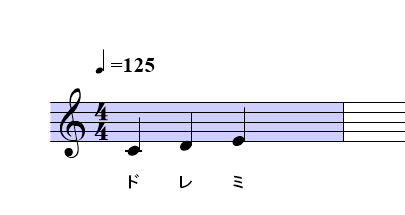
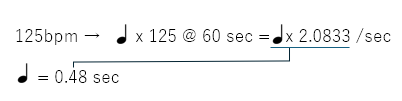

# ソングAPIの使い方

VOICEVOX v0.16より、APIをつかって歌を歌うことができる様になりました。

## 例題とする楽譜



## APIの送信例

``` bash
echo -n '{
  "notes": [
    { "key": null, "frame_length": 15, "lyric": "" },
    { "key": 60, "frame_length": 45, "lyric": "ド" },
    { "key": 62, "frame_length": 45, "lyric": "レ" },
    { "key": 64, "frame_length": 45, "lyric": "ミ" },
    { "key": null, "frame_length": 15, "lyric": "" }
  ]
}' > score.json

curl -s \
    -H "Content-Type: application/json" \
    -X POST \
    -d @score.json \
    "127.0.0.1:50021/sing_frame_audio_query?speaker=6000" \
    > query.json

curl -s \
    -H "Content-Type: application/json" \
    -X POST \
    -d @query.json \
    "127.0.0.1:50021/frame_synthesis?speaker=3001" \
    > audio.wav
```

## 基礎的な考え方

歌声を生成するには、指示値を計算するために必要な「前提となるパラメータ」をAPIを用いて取得する必要があります。

### 1.アクセスポイントの取得

APIのアクセスポイントをさがします。一般的には ``http://localhost:50021/``あたりになりますが、正しい数値は情報ファイルである ```C:\Users\(ユーザ名)\AppData\Roaming\voicevox\runtime-info.json```を参照することで得られます。

``` json
{
    "formatVersion":X,
    "appVersion":"0.XX.X",
    "engineInfos":[
        {
            "uuid":"00000000-0000-0000-00000-000000000000","url":"http://127.0.0.1:50021","name":"VOICEVOX Engine"
        }
    ]
}
```

このURLと表記されているURLがアクセスポイントになります。

### 2. 歌声の指定

VOICEVOXでは、歌い方と声を分けて生成しています。その指定をするためには ``http://localhost:50021/singers``にアクセスして、歌声リストを手にいれます。

``` json
[
  {
    "name": "波音リツ",
    "speaker_uuid": "00000000-0000-0000-0000-000000000000",
    "styles": [
      {
        "name": "クイーン",
        "id": 3065,
        "type": "frame_decode"
      },
      {
        "name": "ノーマル",
        "id": 6000,
        "type": "sing"
      }
    ],
    "version": "0.15.3"
  }
]
```

歌い方を指定するためにつかえるIDとしては、typeが``sing``になっているもののみです。（ほかのIDを指定すると生成時エラーとなるため注意してください）

歌い方（クエリデータ）から歌声に変えるときには、typeが``frame_decode``となっているものを指定できます。

ここでは、歌い方を指定するIDは``6000``、歌声は``3065``と仮定して説明を進めます。

### 3. 計算に必要な数値の取得

楽譜データを歌声にかえるためには、楽譜を内部の計算値に変換したJSONを用意する必要があります。そのために必要な係数を取得します。係数は``http://localhost:50021/engine_manifest``で取得できます。

```JSON
    "default_sampling_rate": 24000,
    "frame_rate": 93.75,
```

この ``frame_rate``が計算に必要な値となります。

### 4. 楽譜用JSONデータの作成

楽譜用のJSONデータは下記のようなフォーマットになります。

``` json
{
  "notes": [
    { "key": null, "frame_length": 15, "lyric": "" },
    { "key": 60, "frame_length": 45, "lyric": "ド" },
    { "key": 62, "frame_length": 45, "lyric": "レ" },
    { "key": 64, "frame_length": 45, "lyric": "ミ" },
    { "key": null, "frame_length": 15, "lyric": "" }
  ]
}
```

音程は ``key``、発音長は ``frame_length``、発話語は ``leric`` で指定することになります。

#### 4.1 フレーム長の考え方

frame_lengthはこのように計算します。



テンポが125bpm であるとき、4分音符は ``60秒あたり 125 回叩かれるリズム``ということになります。すなわち、``４分音符１回あたり0.48 秒``になります。

フレーム長の数字は、``frame_rate`` に時間をかけたものになりますので、４分音符１つ分の時間で歌わせるためには、``0.48 ✕ 93.75 = 45.0`` となります。

この数字は小数点のついた数字になりますが、VOICEVOX二指定するときには四捨五入した整数値で指示するようにしてください。

#### 4.2 その他の値の決め方

key は 音の高さ（MIDIノートナンバー）になります。真ん中のドの音が 60 となります。nullが指定された場合は無音になります。

lyricは発話語になります。カタカナで１語入れます。nullが指定された場合は無音になります。

### 5. クエリの生成

楽譜データを歌い方データ（クエリデータ）に変換するには、``http://localhost:50021/sing_frame_audio_query`` にアクセスします。

楽譜データはPOSTで送信してください。 curlが使える場合は、下記のようなコマンドで送信できます。speakerには手順2で取得したIDを指定します。

``` bash
curl -s \
    -H "Content-Type: application/json" \
    -X POST \
    -d @score.json \
    "127.0.0.1:50021/sing_frame_audio_query?speaker=6000" \
    > query.json
```

うまく行けば、``query.json``ファイルが生成されます。

### 6. 歌声の生成

楽譜データを歌い方データ（クエリデータ）に変換するには、``http://localhost:50021/frame_synthesis`` にアクセスします。

先程の``query.json``（クエリデータ）の中身をPOSTで送信してください。 curlが使える場合は、下記のようなコマンドで送信できます。speakerには手順2で取得した歌わせたい声のIDを指定します。

``` bash
curl -s \
    -H "Content-Type: application/json" \
    -X POST \
    -d @query.json \
    "127.0.0.1:50021/frame_synthesis?speaker=3065" \
    > audio.wav
```

うまく行けば、``audio.wav``ファイルが生成されます
