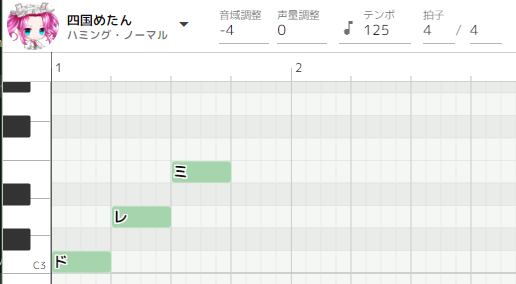

# ソングAPIの使い方

## はじめに

### 概要

VOICEVOX v0.16より、APIを使って歌を歌うことができるようになりました。

### 目的

このドキュメントでは、ソングAPIの基本的な使い方と、実際に音声を生成するための手順を説明します。

## 前提条件

### 必要なツールと環境

- VOICEVOXエンジン（単体もしくはVOICEVOXインストーラで導入したもの）
- curl もしくは、HTTPリクエストを送付できるツール

## 基本概念

### APIのアクセスポイント

#### VOICEVOX エディタ経由で起動したエンジンを使う場合

エディタ経由でエンジンを起動する場合は、エディタが通信ポート番号を変更指示していることがあります。現在有効なAPIのアクセスポイントを取得するには、以下のJSONファイルを参照します：

情報ファイルの場所： ` C:\Users\(ユーザ名)\AppData\Roaming\voicevox\runtime-info.json `

``` json
{
    "formatVersion": X,
    "appVersion": "0.XX.X",
    "engineInfos": [
        {
            "uuid": "00000000-0000-0000-00000-000000000000",
            "url": "http://127.0.0.1:50021",
            "name": "VOICEVOX Engine"
        }
    ]
}
```

このURLがアクセスポイントになります。

#### 直接エンジンを起動して使う場合

VOICEVOXエンジンを直接起動する場合は、エンジン規定の通信ポートになります（起動時に表示されます）

### 歌い方と歌声の指定

`http://localhost:50021/singers` にアクセスして、リストを取得します。

``` json
[
  {
    "name": "波音リツ",
    "speaker_uuid": "00000000-0000-0000-0000-000000000000",
    "styles": [
      {
        "name": "クイーン",
        "id": 3065,
        "type": "frame_decode"
      },
      {
        "name": "ノーマル",
        "id": 6000,
        "type": "sing"
      }
    ],
    "version": "0.15.3"
  }
]
```

歌い方には、`type` が `sing` もしくは `singing_teacher` になっているIDを指定します。また、歌声を変える場合は、typeが``frame_decode``となっているものを歌声指定できます。

### 計算に必要な数値の取得

`http://localhost:50021/engine_manifest` で取得できます。

```JSON
    "default_sampling_rate": 24000,
    "frame_rate": 93.75,
```

この `frame_rate` が計算に必要な値となります。

## 実装手順

### 例題とする楽譜




### 楽譜用JSONデータの作成

``` bash
echo -n '{
  "notes": [
    { "key": null, "frame_length": 47, "lyric": "" },
    { "key": 60, "frame_length": 45, "lyric": "ド" },
    { "key": 62, "frame_length": 45, "lyric": "レ" },
    { "key": 64, "frame_length": 45, "lyric": "ミ" },
    { "key": null, "frame_length": 47, "lyric": "" }
  ]
}' > score.json
```

#### フレーム長の考え方

125bpmとは、1分間に4分音符が125回となる速さです。秒数換算は 1÷（125÷60）＝0.48秒となります。

その時指定すべきフレーム長 `frame_length = 0.48 ✕ 93.75 = 45.0` です。

よって、この例題の場合は45と指定します。（数値は四捨五入し整数で指定します）

#### その他の値の決め方

- `key` は音の高さ（MIDIノートナンバー）を指定。真ん中のドは60です。
- `lyric` はカタカナで1語入れます。nullが指定された場合は無音になります。

#### 前後の空白

発話予備動作により、前後に余白が必要となります。余白が短い場合はぶつ切りになったり、発話がうまくできない可能性があります。

そのため、音声品質を確保するには前後に充分な空白を入れることを推奨します。（例題のJSONにも入れてあります）

明確な推奨値はないですが、VOICEVOXエディタに合わせるなら 0.5秒以上を指定してください。

### クエリの生成

楽譜データを歌い方データ（クエリデータ）に変換するには、以下のコマンドを実行します：

``` bash
curl -s \
    -H "Content-Type: application/json" \
    -X POST \
    -d @score.json \
    "127.0.0.1:50021/sing_frame_audio_query?speaker=6000" \
    > query.json
```

### 歌声の生成

クエリデータを用いて歌声を生成します：

``` bash
curl -s \
    -H "Content-Type: application/json" \
    -X POST \
    -d @query.json \
    "127.0.0.1:50021/frame_synthesis?speaker=3065" \
    > audio.wav
```

## まとめ

このAPIをつかうことで、サードパーティツール側から歌声を生成できます。
特性をよく知ったうえで、VOICEVOXを楽しく上手に活用してみてください。
